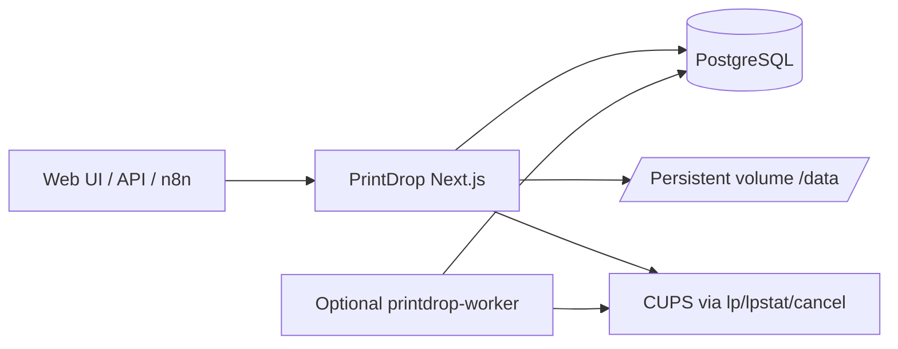

# PrintDrop

Self-hosted print job intake and routing for CUPS — Next.js App Router, Prisma, Tailwind, atomic design UI.

## Overview

PrintDrop receives print jobs from humans, scripts, and automation platforms, validates files, enforces quotas, persists job metadata, and forwards approved jobs to a configured CUPS queue (`CUPS_SERVER` + `PRINTER_NAME`).

## Features

- Dark, mobile-friendly web UI (collapsible sidebar) with session cookie auth
- Roles: `admin` / `user`
- Print approval modes: automatic (`requiresApproval=false`) or manual
- Daily/weekly page quotas (copies count; released on reject/fail/cancel)
- PDF / PNG / JPG validation + page counting
- Job lifecycle: pending → approved → queued → printing → completed / failed / rejected / cancelled
- External API key auth for `POST /api/v1/print` only
- Bootstrap admin from `ADMIN_USERNAME` / `ADMIN_PASSWORD`
- Audit logs
- Optional CUPS status sync worker
- Docker + GHCR + Dockge compose under `deploy/`

## Architecture



### Stack

- Next.js 15 (App Router) + TypeScript + Server Actions
- Tailwind CSS (PostCSS) + atomic design under `src/components/{atoms,molecules,organisms,templates}`
- Prisma (SQLite locally / PostgreSQL in Docker)
- iron-session httpOnly cookies (`SECURE_COOKIES=false` by default for HTTP Dockge)
- CUPS via `child_process.spawn` argv arrays (no shell)

## Folder structure

```
src/
  app/                  # App Router pages + API routes
  components/
    atoms/
    molecules/
    organisms/
    templates/
  lib/
    auth/
    db/
    services/           # jobs, quotas, cups, documents, audit, …
scripts/                # worker + docker entrypoint
prisma/                 # schema + migrations
deploy/                 # Dockge compose + env example
```

## Local development

### Prerequisites

- Node.js 22+
- Optional: CUPS client tools (`lp`, `lpstat`) for live printer tests

### Setup

```bash
cp .env.example .env   # or use the committed local .env template values
npm install
npx prisma db push
npm run dev
```

App: [http://localhost:8000](http://localhost:8000)

Default bootstrap admin comes from `ADMIN_USERNAME` / `ADMIN_PASSWORD`.

### Quality checks

```bash
npm run lint
npm test
npm run build
```

### Optional worker (local)

```bash
RUN_SCHEDULER=true npm run worker
```

## Docker / Dockge

Assets live under `deploy/`:

1. `cp deploy/.env.example deploy/.env` and set secrets + CUPS host.
2. Set `PRINTDROP_IMAGE` to your GHCR image (or build locally).
3. `docker compose -f deploy/compose.yaml --env-file deploy/.env up -d`
4. Worker profile: `docker compose -f deploy/compose.yaml --env-file deploy/.env --profile worker up -d`

Build locally:

```bash
docker build -t printdrop:local .
```

Container notes:

- Non-root user `uid=10001`
- Healthcheck on `/healthz`
- Entrypoint runs `prisma db push` then `next start` (or worker when `RUN_AS_WORKER=true`)
- Uploads at `/data/uploads`
- Does **not** reconfigure CUPS queues — uses existing `PRINTER_NAME`

### SECURE_COOKIES

- Default `false` for plain HTTP (`:8000`) in Dockge
- Set `true` only behind HTTPS (TLS reverse proxy); otherwise browsers drop the session cookie and login fails

## External API

| Method | Path | Auth |
|---|---|---|
| `POST` | `/api/v1/print` | `X-Print-Api-Key` or `Authorization: Bearer` |
| `GET` | `/api/v1/jobs/{uuid}` | Session **or** API key |
| `GET` | `/api/v1/health` | none |
| `GET` | `/api/v1/printer/status` | Session |
| `GET` | `/healthz` | none |

### Submit example

```bash
curl -X POST "http://localhost:8000/api/v1/print" \
  -H "X-Print-Api-Key: ${PRINT_API_KEY}" \
  -F "username=admin" \
  -F "copies=1" \
  -F "file=@./document.pdf"
```

## Environment variables

See `deploy/.env.example`. Important:

| Variable | Purpose |
|---|---|
| `DATABASE_URL` | Prisma URL (`file:./prisma/dev.db` locally; `postgresql://…` in Docker) |
| `SESSION_SECRET` | iron-session secret (≥32 chars) |
| `PRINT_API_KEY` | External print API |
| `ADMIN_USERNAME` / `ADMIN_PASSWORD` | First-run bootstrap admin |
| `CUPS_SERVER` / `PRINTER_NAME` | Existing CUPS queue (default `HP_LaserJet_M15w`) |
| `SECURE_COOKIES` | `false` for HTTP; `true` for HTTPS |
| `RUN_SCHEDULER` | Enable in-process / worker CUPS sync |

## Database

- Local/tests: SQLite via `DATABASE_URL=file:./prisma/dev.db`
- Production (Dockge): PostgreSQL service + `postgresql://…` URL
- Entrypoint selects Prisma provider from the URL scheme

## Security notes

- Never bake secrets into the image
- Never put `PRINT_API_KEY` in browser JS
- Rotate `SESSION_SECRET` and `PRINT_API_KEY` periodically
- See `SECURITY.md`

## License

MIT. See `LICENSE`.
