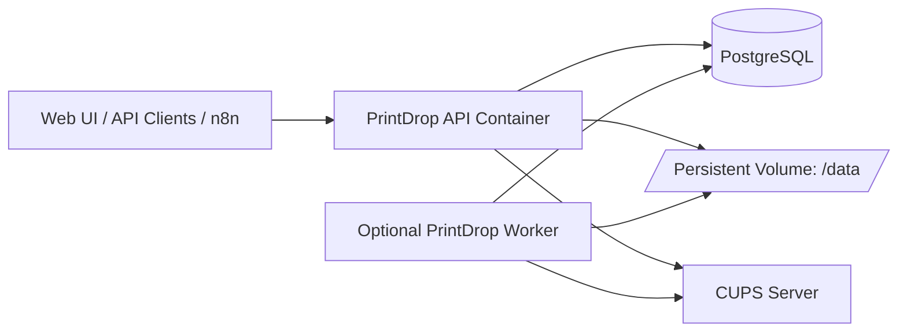

# PrintDrop

Self-hosted print job intake and routing service for CUPS-backed environments.

## Overview

PrintDrop is a FastAPI-based service designed to receive print jobs from humans, scripts, and automation platforms, validate files, persist job metadata, and forward approved jobs to a configured CUPS queue.

## Features

- API and web-based print submission workflow
- CUPS target printer routing via `CUPS_SERVER` + `PRINTER_NAME`
- Configurable file type validation using `python-magic` + `file` tooling
- Configurable rate limits, retention windows, and upload limits
- Bootstrap admin creation via environment variables on first run
- Optional dedicated scheduler worker process
- Dockerized deployment for Dockge or plain Docker Compose

## Architecture



## Screenshots

Replace placeholders with your own captures once UI is available:


## Local Development

### Prerequisites

- Python 3.12
- Docker (for local Postgres/CUPS if desired)

### Install

```bash
python -m venv .venv
source .venv/bin/activate
pip install -U pip
pip install ".[dev]"
```

### Developer quality tooling

```bash
ruff check .
black --check .
mypy app
pytest
```

## Docker (Production Image)

`Dockerfile` is built for production:

- Base: `python:3.12-slim`
- Non-root runtime user (`uid=10001`)
- Includes CUPS + file signature dependencies (`cups-client`, `file`, `libmagic1`)
- Signal-safe init via `tini`
- Gunicorn + Uvicorn workers (`uvicorn.workers.UvicornWorker`)
- Built-in healthcheck against `/healthz`

Build locally:

```bash
docker build -t printdrop:local .
```

## Dockge Deployment

Deployment assets are under `deploy/`:

- `deploy/compose.yaml`
- `deploy/.env.example`

### Setup

1. Copy env template:

   ```bash
   cp deploy/.env.example deploy/.env
   ```

2. Edit `deploy/.env` with secure secrets and your CUPS/printer values.
3. In Dockge, create/import stack from `deploy/compose.yaml`.
4. Ensure the stack working directory includes the `deploy/.env` file.

### Start

```bash
docker compose -f deploy/compose.yaml --env-file deploy/.env up -d
```

### Start with separate scheduler worker

```bash
docker compose -f deploy/compose.yaml --env-file deploy/.env --profile worker up -d
```

## GHCR Settings

The GitHub Actions workflow publishes to:

`ghcr.io/<owner>/printdrop`

Required repository settings:

- Actions enabled
- Package permissions allow GitHub Actions to publish
- Default `GITHUB_TOKEN` has package write permission

Image selection in compose is env-driven:

`PRINTDROP_IMAGE` (default: `ghcr.io/OWNER/printdrop:latest`)

## Environment Variables

Compose uses uppercase variables from `deploy/.env` for both service and application runtime configuration.

| Variable | Required | Purpose | Example |
|---|---|---|---|
| `PRINTDROP_IMAGE` | No | Docker image tag for stack | `ghcr.io/acme/printdrop:latest` |
| `PRINTDROP_PORT` | No | Host port binding for API | `8000` |
| `DATABASE_URL` | Yes | SQLAlchemy connection string | `postgresql+psycopg://...` |
| `POSTGRES_DB` | Yes (postgres svc) | Postgres database name | `printdrop` |
| `POSTGRES_USER` | Yes (postgres svc) | Postgres user | `printdrop` |
| `POSTGRES_PASSWORD` | Yes | Postgres password | `change-me` |
| `SESSION_SECRET` | Yes | Session signing secret | random 64 chars |
| `PRINT_API_KEY` | Yes | API auth key for submit endpoint | random long token |
| `ADMIN_USERNAME` | Yes | Bootstrap admin username | `admin` |
| `ADMIN_PASSWORD` | Yes | Bootstrap admin password | strong password |
| `CUPS_SERVER` | Yes | Hostname/IP of CUPS server | `host.docker.internal` |
| `PRINTER_NAME` | Yes | CUPS queue name | `HP_LaserJet_M15w` |
| `RUN_SCHEDULER` | No | Enables in-process scheduler | `false` |
| `PRINTDROP_WORKER_COMMAND` | No | Optional worker command override | `python -m app.worker` |
| `TZ` | No | Container timezone | `UTC` |
| `MAX_UPLOAD_MB` | No | Upload size cap | `20` |
| `SECURE_COOKIES` | No | Set secure cookie flag | `true` |
| `FORCE_PASSWORD_CHANGE_DEFAULT` | No | Require bootstrap password change | `true` |

## CUPS Queue Requirement

`PRINTER_NAME` must match an existing queue on the target CUPS server. Validate queue names on the CUPS host:

```bash
lpstat -p
```

If PrintDrop runs in Docker and CUPS runs on host, use:

- `CUPS_SERVER=host.docker.internal`
- Compose already includes `extra_hosts: host.docker.internal:host-gateway`

## Database Migrations

This repository includes Alembic migration scripts in `migrations/`.

Typical migration commands:

```bash
alembic upgrade head
# Optional, when authoring schema changes:
alembic revision --autogenerate -m "message"
```

## Bootstrap Admin Behavior

On first startup, backend should create the admin user from:

- `ADMIN_USERNAME`
- `ADMIN_PASSWORD`

Recommended behavior:

- Create only if no admin exists
- Force password reset on first login when `FORCE_PASSWORD_CHANGE_DEFAULT=true`
- Ignore/bootstrap vars after initial admin creation

## Backup and Restore

### Backup Postgres

```bash
docker exec -t printdrop-postgres pg_dump -U "$POSTGRES_USER" "$POSTGRES_DB" > printdrop.sql
```

### Restore Postgres

```bash
cat printdrop.sql | docker exec -i printdrop-postgres psql -U "$POSTGRES_USER" "$POSTGRES_DB"
```

### Backup uploaded files

```bash
docker run --rm -v printdrop_data:/data -v "$PWD":/backup alpine tar czf /backup/printdrop-data.tgz /data
```

## Update and Rollback

### Exact Dockge update commands

```bash
docker compose -f deploy/compose.yaml --env-file deploy/.env pull
docker compose -f deploy/compose.yaml --env-file deploy/.env up -d
docker image prune -f
```

### Pin to a specific image tag

Set `PRINTDROP_IMAGE` in `deploy/.env`, then:

```bash
docker compose -f deploy/compose.yaml --env-file deploy/.env pull
docker compose -f deploy/compose.yaml --env-file deploy/.env up -d
```

### Rollback

1. Set `PRINTDROP_IMAGE` back to known-good tag.
2. Re-run:

```bash
docker compose -f deploy/compose.yaml --env-file deploy/.env pull
docker compose -f deploy/compose.yaml --env-file deploy/.env up -d
```

## Reverse Proxy and Cloudflare Guidance

- Run PrintDrop behind Caddy, Nginx, or Traefik for TLS termination.
- Set `SECURE_COOKIES=true` when behind HTTPS.
- Ensure proxy forwards:
  - `X-Forwarded-For`
  - `X-Forwarded-Proto`
  - `Host`
- If using Cloudflare:
  - Use Full (strict) SSL mode
  - Restrict origin firewall to Cloudflare IP ranges when possible
  - Consider Cloudflare Access for admin routes

## API Examples

### Health check

```bash
curl -sS http://localhost:8000/healthz
```

### Submit print job (example endpoint shape)

```bash
curl -X POST "http://localhost:8000/api/print" \
  -H "Authorization: Bearer ${PRINT_API_KEY}" \
  -F "file=@/path/to/document.pdf"
```

### Query jobs (example endpoint shape)

```bash
curl -sS "http://localhost:8000/api/jobs?limit=20" \
  -H "Authorization: Bearer ${PRINT_API_KEY}"
```

## n8n Example

Use an HTTP Request node:

- Method: `POST`
- URL: `http://printdrop:8000/api/print`
- Auth Header: `Authorization: Bearer {{$env.PRINT_API_KEY}}`
- Body: multipart form-data with binary file field `file`

## Troubleshooting

- **Container unhealthy**: verify `/healthz` exists and app listens on `0.0.0.0:8000`.
- **Cannot connect to Postgres**: verify `DATABASE_URL`, network, and Postgres health.
- **CUPS connection errors**: verify `CUPS_SERVER` DNS reachability from container.
- **Printer not found**: ensure `PRINTER_NAME` exactly matches CUPS queue.
- **Permission issues on data volume**: verify volume mounted at `/data`.

## Security Notes

- Rotate `SESSION_SECRET` and `PRINT_API_KEY` periodically.
- Never commit `deploy/.env`.
- Use least-privilege network exposure; prefer reverse-proxy ingress only.
- Keep base image and Python dependencies updated.
- Review `SECURITY.md` for policy and reporting process.

## License

MIT. See `LICENSE`.
